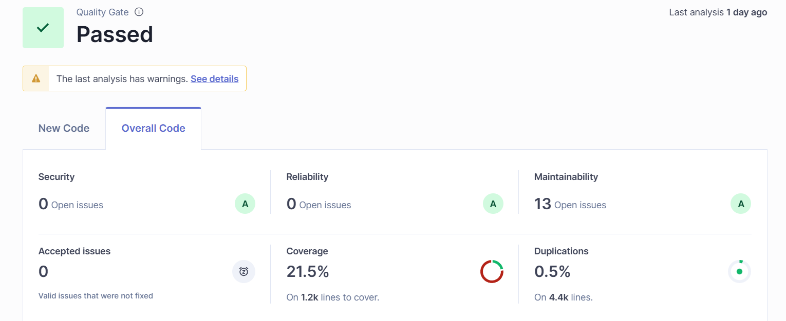

# 🏥 Medic App - Sistema de Gestión para Consultorio Médico

Proyecto desarrollado con **Java Spring Boot** como práctica integral para implementar una arquitectura limpia, buenas prácticas de programación y herramientas modernas de desarrollo profesional.

---

## 📌 Descripción

**Medic App** es una aplicación que gestiona las operaciones básicas de una clínica o consultorio médico, incluyendo la administración de pacientes, médicos, citas y autenticación de usuarios. Este proyecto está diseñado como ejemplo técnico para demostrar habilidades avanzadas de backend, testing y arquitectura de software.

> ⚠️ **Este proyecto NO está destinado a producción**, sino a servir como base de formación y evaluación técnica personal.

---

## 🧱 Características Técnicas

- ✅ **Arquitectura limpia** aplicada.
- ✅ **Integración con SonarQube** para análisis estático de código.

- ✅ **Servidor Redis** para mejora de performance vía cache.
- ✅ **Uso de patrones de diseño**, incluyendo el patrón *Builder*.
- ✅ **Rollback transaccional** para garantizar integridad de datos.
- ✅ **Programación funcional** aplicada en controladores y servicios.
- ✅ **Buenas prácticas** y estilo de código profesional.
- ✅ **Documentación técnica incluida**.

---


## 🔒 Seguridad y Autenticación

- Implementación de **Spring Security**.
- Generación y validación de **JWT** (JSON Web Tokens).
- Control de acceso por **roles y permisos**.

---


## 🧪 Testing

Este proyecto incorpora pruebas unitarias y de comportamiento utilizando:

- **JUnit 4.13.2**
- **Mockito 5.18.0**
- **Jacoco** para cobertura de código.

---


## ⚙️ Tecnologías y Dependencias

| Tecnología       | Descripción                        |
|------------------|------------------------------------|
| Spring Boot      | Backend principal (versión 3.2.3)  |
| Spring Data JPA  | Persistencia con MySQL             |
| MySQL            | Base de datos relacional           |
| Redis            | Sistema de cache                   |
| Lombok           | Reducción de boilerplate           |
| JWT              | Seguridad y autenticación          |
| Maven            | Gestión de dependencias            |

---


## 🚀 Requisitos para ejecución

Antes de ejecutar la aplicación, asegúrate de contar con:

- ✅ **Java 21**
- ✅ **Maven**
- ✅ **Docker + Docker Compose**
- ✅ **MySQL**
- ✅ **Redis**

---


## 🛠 Configuración

1. Clona el repositorio:

   ```bash
   git clone https://github.com/tu-usuario/medic-app.git
   cd medic-app

2. Ajusta las variables en
    ```bash
    src/main/resources/application.propertie
3. Inicia los servicios de MySQL y Redis acorde a su DOCKERFILE adjutando en los recursos
     ```bash
        src/main/resources/data
        - Dockerfile_MySQL
        - Dockerfile_REDIS
4. Sobre la instancia de MYSQL montado Ejecutar los .sql segun el Orden
    - DDL.sql
    - DML.sql
---

## 📋 Documentación

- La documentación de endpoints, estructura de carpetas, DTOs, servicios y excepciones se encuentra comentada dentro del código fuente y se incluye la **COLLECTION** de cada **ENDPOINT** con sus casos de usos dentro de
    ```bash
    src/resources/data/COLLECTION.json

---

## 🎯 Objetivo del Proyecto
Este proyecto tiene como fin servir de ejemplo y base para:

- Entender arquitectura limpia en Spring Boot

- Aplicar buenas prácticas reales en el desarrollo backend

- Mostrar habilidades en pruebas, seguridad y rendimiento

- Servir como demostración profesional en entrevistas o portafolios
---

## 📬 Autor
Desarrollado por: John Cuvi - Ingeniero de Software
📧 Email: jhoncuvi12@gmail.com
📧 Linkedin: https://www.linkedin.com/in/john-cuvi-ba8246272/


